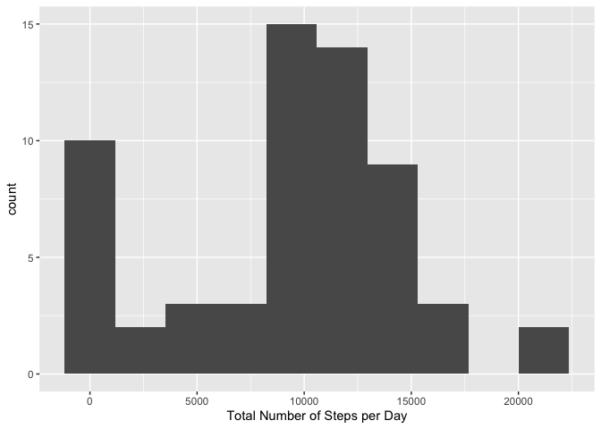
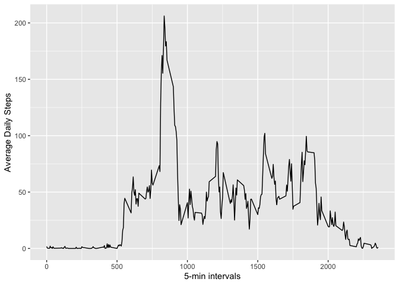
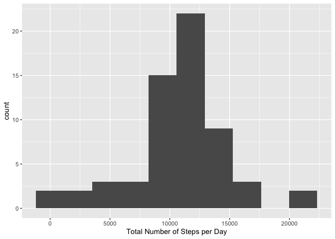
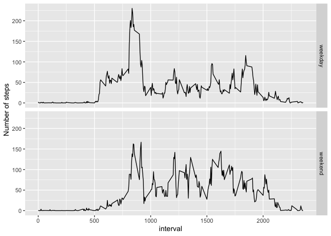

# Reproducible Research: Peer Assessment 1

## Loading and preprocessing the data

```r
library(lubridate)
```

```
## 
## Attaching package: 'lubridate'
```

```
## The following object is masked from 'package:base':
## 
##     date
```

```r
unzip("activity.zip")

data <- read.csv("activity.csv", header=TRUE, na.strings="NA")
data$date<-ymd(data$date)
```


## What is mean total number of steps taken per day?

```r
library(dplyr)
```

```
## 
## Attaching package: 'dplyr'
```

```
## The following objects are masked from 'package:lubridate':
## 
##     intersect, setdiff, union
```

```
## The following objects are masked from 'package:stats':
## 
##     filter, lag
```

```
## The following objects are masked from 'package:base':
## 
##     intersect, setdiff, setequal, union
```

```r
library(ggplot2)

data<-group_by(data, date)
total_steps <- summarize(data, total = sum(steps, na.rm=TRUE))

ggplot(data = total_steps, aes(x = total)) + 
  geom_histogram(bins = 10) +
  labs(x = "Total Number of Steps per Day")
```

<!-- -->

```r
mean <- round(mean(total_steps$total), 2)
median <- median(total_steps$total)
```

The mean and median total number of steps taken per day are: mean = 9354.23, median = 10395

## What is the average daily activity pattern?

```r
data<-ungroup(data)
data<-group_by(data, interval)
avg_steps <- summarize(data, avg = mean(steps, na.rm = TRUE))
avg_steps <- arrange(avg_steps, interval)
ggplot(data = avg_steps, aes(x = interval, y = avg)) + geom_line() +
  labs(x = "5-min intervals", y = "Average Daily Steps")
```

<!-- -->

```r
max_steps <- max(avg_steps$avg)
max_interval <- avg_steps[avg_steps$avg == max_steps, "interval"]
```

The 5-minute interval, on average across all the days, that contains the maximum number of steps is: 835

## Imputing missing values

```r
missing <- nrow(data[is.na(data$steps),])
```

The number of rows with missing data is 2304.

### Impute using mean for that 5-min interval and create new dataset

```r
imputed_data<-data

for (i in avg_steps$interval){
  imputed_data[imputed_data$interval==i & is.na(imputed_data$steps),"steps"] <- avg_steps[avg_steps$interval == i, "avg"]
}
```

### histogram of the total number of steps taken each day

```r
imputed_data<-group_by(imputed_data, date)
total_steps <- summarize(imputed_data, total = sum(steps))

ggplot(data = total_steps, aes(x = total)) + 
  geom_histogram(bins = 10) +
  labs(x = "Total Number of Steps per Day")
```

<!-- -->

```r
options(scipen=999)
mean <- round(mean(total_steps$total), 2)
median <- round(median(total_steps$total), 2)
```

The mean and median total number of steps taken per day are: mean = 10766.19, median = 10766.19
These numbers are different from the estimates from the first part of the assignment.


## Are there differences in activity patterns between weekdays and weekends?

```r
imputed_data[,"weekend"] <- "weekday"
imputed_data[wday(imputed_data$date, label = TRUE) %in% c("Sun", "Sat"),"weekend"] <- "weekend"
imputed_data$weekend<-factor(imputed_data$weekend)

imputed_data<-group_by(imputed_data, weekend, interval)
avg_steps <- summarize(imputed_data, avg = mean(steps)) %>% 
  arrange(interval)


ggplot(data = avg_steps, aes(x = interval, y = avg)) + 
  facet_grid(rows = vars(weekend)) +
  geom_line() + 
  labs(y = "Number of steps")
```

<!-- -->
